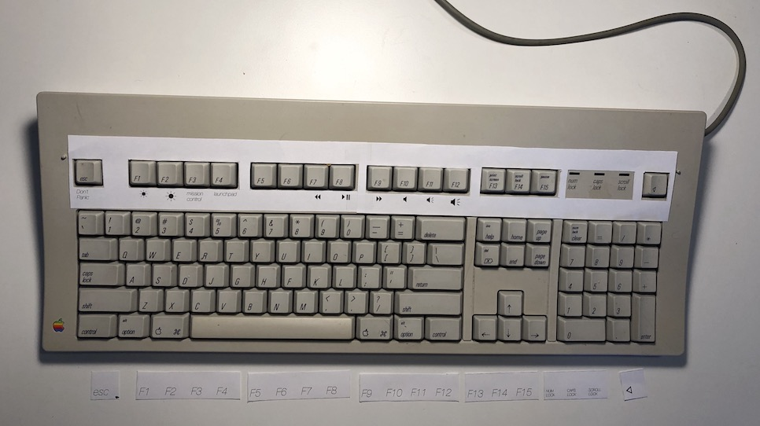

AEK-template
============

Printable template for the [Apple Extended Keyboard](https://deskthority.net/wiki/Apple_Extended_Keyboard) and [Apple Extended Keyboard Ⅱ](https://deskthority.net/wiki/Apple_Extended_Keyboard_II).

This file might need some work on your part, so please read the notes below.

Notes
-----

Technical:

* It's made in Pages version 7.3
* The template is layed out as two tables in centimeters. 
* The width of a normal template (47cm/18.5") would exceed the size of _A3_ (it might fit diagonally), so it's printed in two parts on A4 format.

Usage:

* Page size is _A4_. Some countries might ajust page size.
* I made it optional to use the "template holder pins" (marked by the lowercase letter `o` on the left and right of the template). If you 

Contributions:

* If you have additions which might benefit others, please contact me via Twitter.
* If you want to show off your template, please let me see it.

Badges
------

 This work is licensed under a <a rel="license" href="http://creativecommons.org/licenses/by-sa/4.0/">Creative Commons Attribution-ShareAlike 4.0 International License</a>.

